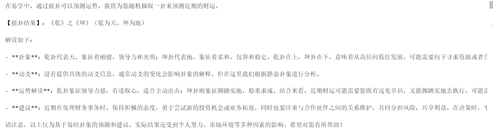

# ZhangBanxian-AI-Divination-RAG


## 本项目基于faiss向量数据库的Qwen模型用RAG检索增强生成的方式实现了一个完整的AI算卦先生。本项目目的是作者用以实践RAG对模型性能的增强效果。本说明最后会放出效果对比。

## Quick Start

###  实验环境

PyTorch 2.3.0

Python 3.12(ubuntu22.04)

Cuda 12.1

**GPU**：RTX 2080 Ti x2(22GB) * 1 (采用8bit量化需要显存16g以上显卡以运行，如显存有限请自行尝试4bit量化)

**CPU**：12 vCPU Intel(R) Xeon(R) Platinum 8336C CPU @ 2.30GHz

**内存**：45GB

### 环境配置

```requirements.txt
accelerate==0.31.0
faiss-cpu==1.8.0
sentence-transformers==3.0.1
sentencepiece==0.2.0
tokenizers==0.19.1
streamlit==1.35.0
transformers==4.41.2
```

### 文件结构

本项目文件结构如下

```
./
    banxian.py # 主函数
    vector_store.index # 向量数据库
    documents.txt # 切割后文本
    web_demo.py # 未实现
    README.md
    requirements.txt # 本机依赖
    tree.py
    VectorBase/ # 向量数据库方法
        vector.py 
        documents.txt
        vector_store.index
        __init__.py
        __pycache__/
    model/ # LLM Agent核心，以Qwen实现
        __init__.py
        model.py
        __pycache__/
    utils/ # 其他方法，如起卦、算筹、prompt工具
        prompt.py
        __init__.py
        divination.py
        __pycache__/
    resource/ # 非代码资源
        Gua.txt
        卦名map.json
    .git/
    assets/ # 其他
        katongbanxian.jpg
```

### 需修改路径

在文件`utils/divination.py`中，你需要将

```import json
with open("/root/banxian/resource/卦名map.json") as f:
    gua_name_map = json.load(f)
```

修改为

```
with open("{项目地址实际}/resource/卦名map.json") as f:
    gua_name_map = json.load(f)
```
### 开始命令
直接在项目主目录下使用`python banxian.py`命令运行进入对话，首次加载会从远端进行模型下载，时间较长，建议使用**科学上网**方法。
## 项目演示效果

### 模型加载


### 起卦与对话


## 有无RAG效果对比

**无RAG**



**有RAG**


